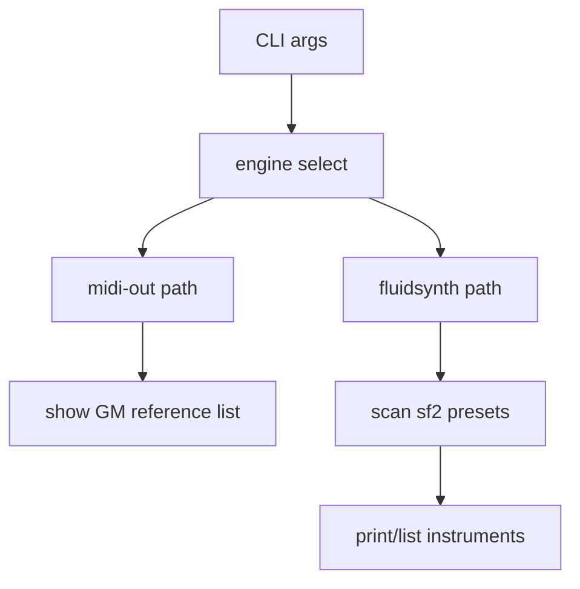

# План: инструменты MIDI в listening mode

## Цель
Сделать в `main.py` режим прослушивания управляемым по тембрам: понятная смена банка/программы, предсказуемое поведение для `midi-out` и `fluidsynth`, и команда для вывода доступных инструментов.

## Текущее состояние (выкладки из проекта)
- Входящие `program_change` и `control_change` уже обрабатываются в [`d:\R_STUDIO\PRG\python\2026-05-23-midi-synt\main.py`](d:\R_STUDIO\PRG\python\2026-05-23-midi-synt\main.py), но это просто проброс событий.
- Для `fluidsynth` начальный тембр задается только при старте через `program_select(channel, sfid, bank, program)`; далее рантайм использует только `program_change`.
- В проекте нет встроенного `.sf2`, поэтому список пресетов зависит от внешнего SoundFont (`--soundfont`).
- В [`d:\R_STUDIO\PRG\python\2026-05-23-midi-synt\README.md`](d:\R_STUDIO\PRG\python\2026-05-23-midi-synt\README.md) описаны движки и запуск, но нет сценария «показать доступные инструменты».

## Что реально позволяют фреймворки
- **mido + python-rtmidi**:
  - умеют отправлять/принимать MIDI-сообщения (`program_change`, `control_change` с CC0/CC32 для Bank Select);
  - не имеют универсального API «дай список тембров синтезатора» для внешнего MIDI-устройства.
- **pyfluidsynth**:
  - умеет точный выбор тембра через `program_select(channel, sfid, bank, preset)`;
  - позволяет получать информацию о пресетах канала (`channel_info`) и имена пресетов (`sfpreset_name`), что можно использовать для построения списка;
  - итоговый набор инструментов определяется конкретным `.sf2`.

## Практический список инструментов, который можно получить
- **Гарантированный baseline**: General MIDI (128 программ, bank 0) + percussion на канале 10 (обычно bank 128) как справочный список.
- **Для `fluidsynth`**: фактический список пресетов из переданного `.sf2` (bank/program/name), то есть «реально доступные» инструменты.
- **Для `midi-out`**: универсально получить список от внешнего синта нельзя; можно показывать только справочный GM-список и пометку, что реальный набор зависит от DAW/VST/устройства.

## Предлагаемая реализация

1. Расширить CLI в [`d:\R_STUDIO\PRG\python\2026-05-23-midi-synt\main.py`](d:\R_STUDIO\PRG\python\2026-05-23-midi-synt\main.py):
   - `--list-instruments` (общий вывод);
   - `--list-instruments-json` (машиночитаемый вывод);
   - `--instrument-filter` (опционально: bank/program/name).
2. Добавить слой «каталога инструментов»:
   - модуль, который возвращает GM-список как fallback;
   - для `fluidsynth` пытается прочитать реальные пресеты `.sf2`.
3. Уточнить рантайм-логику смены тембра в listening mode:
   - зафиксировать порядок `CC0/CC32 -> ProgramChange`;
   - при `fluidsynth` добавить опцию явного `program_select` после bank change для предсказуемости на разных SoundFont.
4. Обновить UX:
   - в `--verbose` печатать текущий `(channel, bank, program, name)` после смены тембра;
   - в ошибках давать подсказки, если `.sf2` не задан для `fluidsynth`.
5. Обновить документацию в [`d:\R_STUDIO\PRG\python\2026-05-23-midi-synt\README.md`](d:\R_STUDIO\PRG\python\2026-05-23-midi-synt\README.md):
   - как менять набор инструментов с клавиатуры;
   - как получить список инструментов для каждого движка;
   - примеры команд для live-режима.

## Проверка результата
- `python main.py --engine fluidsynth --soundfont <file.sf2> --list-instruments-json` выводит не пустой список `bank/program/name`.
- `python main.py --engine midi-out --list-instruments` выводит GM reference + заметку об ограничении внешнего синта.
- В listening mode смена `CC0/CC32 + ProgramChange` предсказуемо меняет тембр (как минимум логически и по выводу в verbose).

## Риски и решения
- Нет унифицированного API у внешних MIDI-синтов для перечисления тембров: оставить это как документированное ограничение.
- Разные SoundFont имеют нестандартные банки: хранить и выводить пары `bank/program` без жестких предположений.
- На некоторых системах `pyfluidsynth`/драйвер может не дать корректный introspection: fallback на GM-список и явное предупреждение.