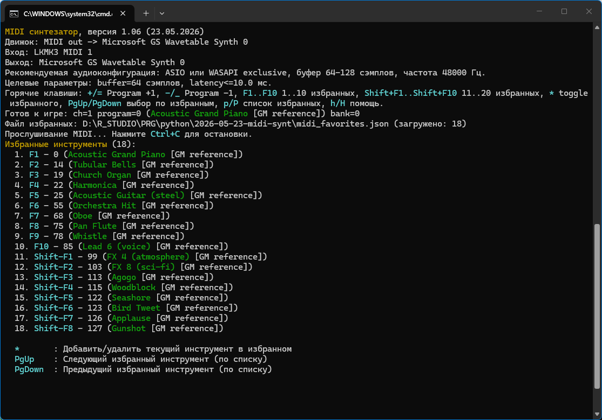
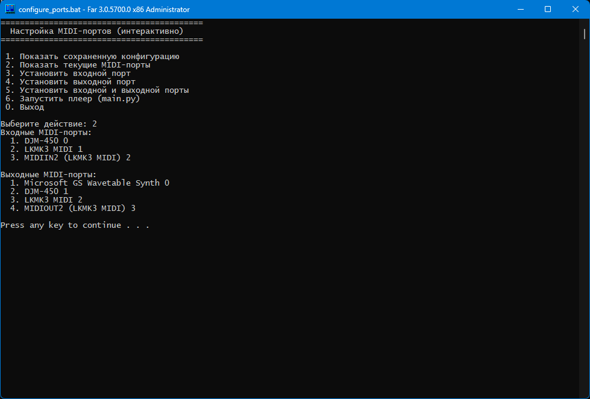

# live-midi-player

`live-midi-player` — MIDI live player для Windows: слушает MIDI-клавиатуру и сразу отправляет ноты в выбранный синтезатор. Подходит для игры в реальном времени, переключения инструментов на лету и быстрых живых сетапов.

**Коротко о проекте:**
- live-воспроизведение MIDI без DAW в минимальном окружении;
- два движка: `midi-out` (рекомендуется) и `fluidsynth`;
- быстрое переключение инструментов (`Program Change`, Bank Select);
- избранные инструменты (до 20 позиций) и горячие клавиши;
- сохранение MIDI-портов в JSON-конфиг.



## Возможности

- **Два режима воспроизведения:**  
  `midi-out` для отправки MIDI во внешний синт (DAW/VST/устройство) и `fluidsynth` для standalone работы через SoundFont (`.sf2`).
- **Live-управление инструментами:**  
  смена `program`/`bank` в реальном времени с логами и GM-именами.
- **Избранные инструменты:**  
  отдельный файл `midi_favorites.json`, быстрый выбор из списка.
- **Сохранение портов:**  
  текущие `input/output` сохраняются в `midi_ports.json`.
- **CLI + batch-скрипты:**  
  готовые команды для установки, настройки, запуска и тестов на Windows.

## Требования

- Windows 10/11
- Python 3.10+ (рекомендуется 3.11+)
- MIDI input-устройство (клавиатура/контроллер)
- (опционально) DAW/VST или внешний MIDI-синтезатор
- (опционально) SoundFont `.sf2` для режима `fluidsynth`

Зависимости из `requirements.txt`:
- `mido`
- `python-rtmidi`
- `pyfluidsynth`

## Быстрый старт (Windows)

1) Установить зависимости и создать виртуальное окружение:

```bat
install.bat
```

2) Активировать окружение:

```bat
act.bat
```

3) Настроить MIDI-порты:

```bat
configure_ports.bat
```



4) Запустить плеер:

```bat
python main.py
```

Быстрый запуск из скрипта:

```bat
start_midi.bat
```

## Управление во время игры

Горячие клавиши в консоли:
- `+` / `=` — следующий инструмент (`Program +1`)
- `-` / `_` — предыдущий инструмент (`Program -1`)
- `F1..F10` — избранные инструменты `1..10`
- `Shift+F1..Shift+F10` — избранные инструменты `11..20`
- `*` — добавить/удалить текущий инструмент в избранном
- `PgUp` / `PgDown` — навигация по избранным
- `p` / `P` — показать список избранных
- `h` / `H` — показать подсказку по клавишам

Дополнительно можно переключать инструменты по MIDI CC:
- `--program-up-cc <0..127>`
- `--program-down-cc <0..127>`

Файл избранных по умолчанию: `midi_favorites.json` (можно переопределить через `--favorites`).

## Настройка портов

Порты можно настраивать интерактивно и через аргументы:

```bat
configure_ports.bat
configure_ports.bat show-config
configure_ports.bat list-ports
configure_ports.bat set --input-port "LKMK3 MIDI 0" --output-port "Microsoft GS Wavetable Synth 0"
configure_ports.bat run --engine midi-out
```

Приоритет выбора портов:
1. CLI-параметры `--input-port` / `--output-port`
2. значения из `midi_ports.json`
3. первый доступный системный порт (fallback)

## CLI примеры (`main.py`)

Показать доступные порты:

```bat
python main.py --list-ports
python main.py --list-ports-json
python main.py --list-ports-json --ports-kind input
```

Работа с конфигом портов:

```bat
python main.py --show-config
python main.py --set-config --input-port "LKMK3 MIDI 0" --output-port "Microsoft GS Wavetable Synth 0"
python main.py --save-ports --engine midi-out --input-port "LKMK3 MIDI 0" --output-port "Microsoft GS Wavetable Synth 0"
```

Запуск через `midi-out` (рекомендуется):

```bat
python main.py --engine midi-out
python main.py --engine midi-out --input-port "LKMK3 MIDI 0" --output-port "Microsoft GS Wavetable Synth 0"
```

Запуск через `fluidsynth`:

```bat
python main.py --engine fluidsynth --soundfont "D:\SoundFonts\piano.sf2" --audio-driver wasapi --sample-rate 48000 --buffer 64
```

Полезные опции:
- `--channel`, `--program`, `--bank`
- `--audio-driver`, `--sample-rate`, `--buffer`, `--latency-target-ms`
- `--config` (путь к файлу портов), `--favorites` (путь к файлу избранных)
- `--verbose` (печатать входящие MIDI-сообщения)

## Проверка live `Program Change`

1. Запустите в verbose-режиме:

```bat
python main.py --engine midi-out --verbose
```

2. Отправьте последовательность: `ProgramChange` -> несколько нот -> новый `ProgramChange` -> снова ноты.
3. Если устройство использует Bank Select, отправляйте `CC0` -> `CC32` -> `ProgramChange`.

Ожидаемые признаки:
- логи `[instrument]` при изменении bank/program;
- логи `[play]` на `note_on` с актуальным `program/bank`;
- слышимое изменение тембра на внешнем синте.

## Тесты

Запуск всех тестов:

```bat
run_tests.bat
```

Запуск конкретного теста:

```bat
run_tests.bat tests/test_program_names.py
run_tests.bat tests/test_program_names.py::test_gm_program_name_hit
```

## Структура проекта

```text
.
├─ main.py
├─ requirements.txt
├─ install.bat
├─ configure_ports.bat
├─ start_MIDI.bat
├─ run_tests.bat
├─ midi_ports.json
├─ midi_favorites.json
├─ tests/
└─ res/scr/
```

## Notes

- Проект ориентирован на Windows (используются консольные hotkeys через `msvcrt`).
- Для минимальной задержки в live-сценариях предпочтителен `midi-out` + DAW/VST с ASIO/WASAPI exclusive.
- `Microsoft GS Wavetable Synth` удобен для проверки, но часто даёт заметную задержку.
